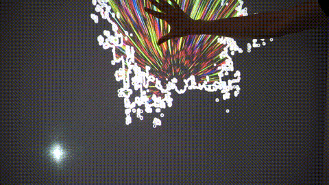

# Exploration Of Depth

[Click to see full video!](https://www.youtube.com/watch?v=UAIzCVQXREE)

Installation prototype by Oskar Koli for the course Generative Media Coding @ Aalto Media Lab.

The interaction is done by using a Kinect to read the depth changes in the sheet when a person pushes it. The visualization is also projected from the other side of the sheet.

Made with Openframeworks.

